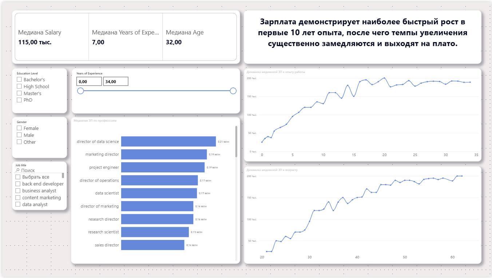

# Salary Analytics

## 📌 О проекте

Исследовательский проект, посвящённый анализу рынка труда и факторов, влияющих на уровень заработной платы.

Цель проекта — продемонстрировать навыки аналитика данных на полном цикле работы с данными:
- очистка и подготовка данных;
- исследовательский анализ (EDA);
- построение модели прогнозирования заработной платы;
- анализ важности признаков;
- создание интерактивного Power BI дэшборда;
- формулирование бизнес-инсайтов.

---

## 🛠 Используемые технологии

- Python
- pandas
- numpy
- matplotlib
- seaborn
- scikit-learn
- CatBoost
- SHAP
- PhiK
- Power BI

---

## 📂 Структура проекта

```text
salary/

├── portfolio_Salary.ipynb
├── Salary_Data.csv
├── Salary_dash.pbix
├── Salary.png
└── readme.md
```

---

# 📊 Выполненный анализ

## Подготовка данных

В ходе работы были выполнены:

- обработка пропусков;
- поиск и удаление дубликатов;
- очистка и унификация названий профессий;
- выделение грейдов специалистов;
- уменьшение количества редких категорий;
- подготовка признаков для моделирования.

---

## Исследовательский анализ данных

Были исследованы зависимости между уровнем заработной платы и различными характеристиками соискателей:

- опыт работы;
- возраст;
- образование;
- должность;
- профессиональный грейд;
- отрасль деятельности.

Для поиска скрытых взаимосвязей использовались корреляционный анализ и визуализация данных.

---

## Построение модели

Для прогнозирования заработной платы использовалась модель **CatBoost**.

Дополнительно выполнен анализ важности признаков с использованием:

- SHAP;
- PhiK.

Это позволило определить факторы, оказывающие наибольшее влияние на уровень дохода.

---

# 📈 Power BI Dashboard

На основе подготовленных данных разработан интерактивный дэшборд.

### Дэшборд позволяет:

- анализировать рынок труда;
- исследовать изменение заработной платы в зависимости от опыта работы;
- сравнивать профессии между собой;
- применять интерактивные фильтры;
- получать количественные инсайты по выбранным группам специалистов.

---

# 💡 Основные выводы

В ходе исследования были получены следующие результаты:

- уровень заработной платы существенно зависит от опыта работы;
- наиболее быстрый рост медианной заработной платы наблюдается в первые 10 лет профессиональной деятельности;
- после достижения определённого уровня опыта темпы роста дохода заметно снижаются;
- должность и профессиональный грейд являются одними из наиболее значимых факторов формирования заработной платы.

---

# 🖼 Пример дэшборда



---

# 🎯 Навыки, продемонстрированные в проекте

- очистка и подготовка данных;
- исследовательский анализ данных (EDA);
- feature engineering;
- работа с категориальными признаками;
- построение моделей машинного обучения;
- интерпретация моделей;
- анализ важности признаков;
- визуализация данных;
- создание интерактивных BI-дэшбордов;
- формулирование бизнес-выводов.

---

# 🚀 Цель проекта

Продемонстрировать практические навыки работы аналитика данных на примере исследования рынка труда: от подготовки данных и проверки гипотез до построения модели и разработки интерактивного дэшборда.